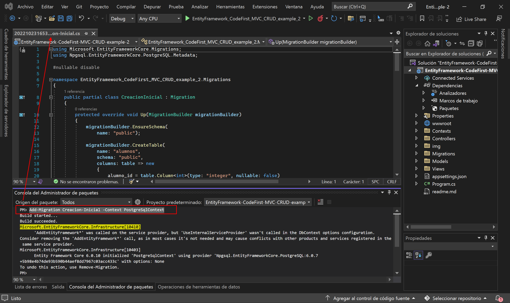
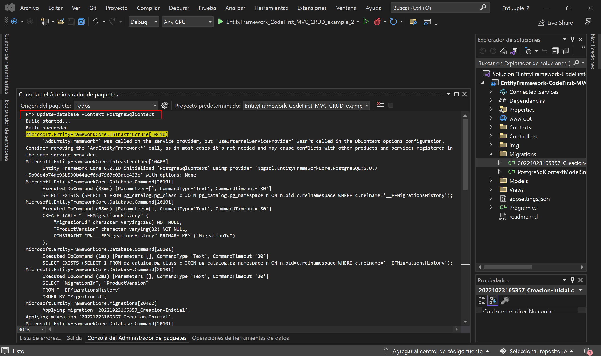
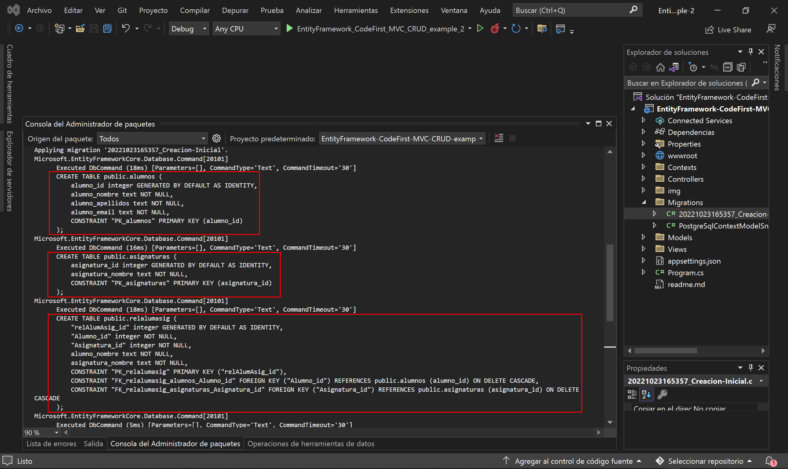
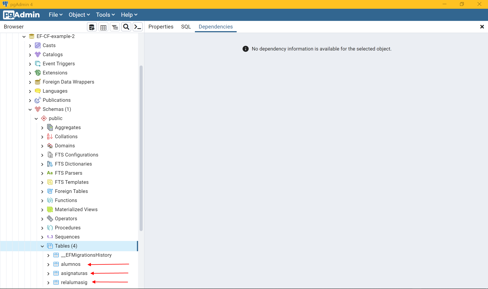
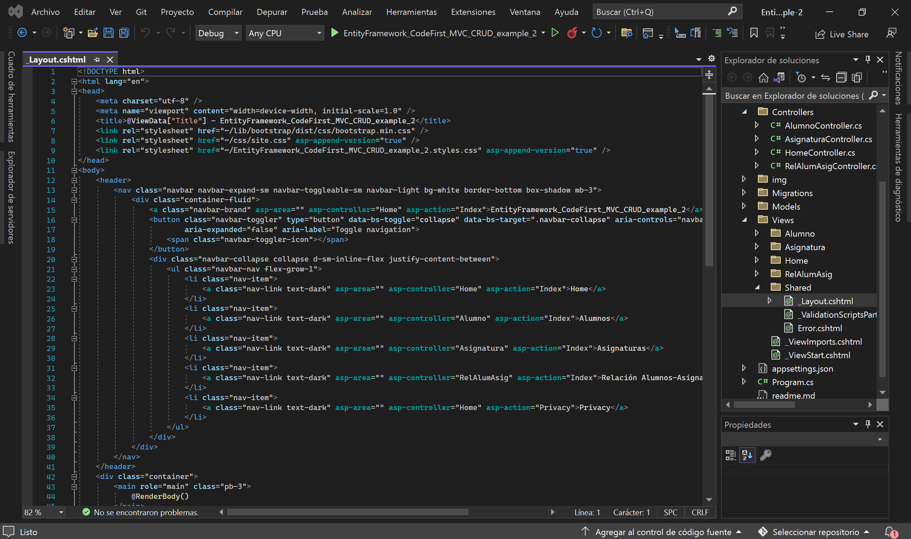

# EntityFramework-CodeFirst-MVC-CRUD-example-2

# 0. Instalar los paquetes NuGets necesarios

- Microsoft.EntityFrameworkCore
- Microsoft.EntityFrameworkCore.Design
- Microsoft.EntityFrameworkCore.Tools
- Npgsql.EntityFrameworkCore.PostgreSQL

# 1. Los modelos

## 1.1. *Models --> AlumnoDTO*

```csharp
using System.ComponentModel.DataAnnotations.Schema;
using System.ComponentModel.DataAnnotations;

namespace ASP.NET_CRUD_example_2.Models
{
    [Table("alumnos", Schema = "public")]
    public class AlumnoDTO
    {
        [Key]
        [Column("alumno_id")]
        [Display(Name = "alumno_id")]
        [DatabaseGenerated(DatabaseGeneratedOption.Identity)] // el autoincrementable
        public int Alumno_id { get; set; }

        [Required]
        [Column("alumno_nombre")]
        [Display(Name = "alumno_nombre")]
        public string Alumno_nombre { get; set; }

        [Required]
        [Column("alumno_apellidos")]
        [Display(Name = "alumno_apellidos")]
        public string Alumno_apellidos { get; set; }

        [Required]
        [Column("alumno_email")]
        [Display(Name = "alumno_email")]
        public string Alumno_email { get; set; }

        /************************ campos para la relación entre alumnos y asignaturas ***************************/

        [InverseProperty("Alumno")]
        public virtual List<RelAlumAsigDTO>? ListaRelAlumAsig { get; set; } // collection navigation property

    }
}
```

## 1.2. *Models --> AsignaturaDTO*

```csharp
using System.ComponentModel.DataAnnotations.Schema;
using System.ComponentModel.DataAnnotations;

namespace ASP.NET_CRUD_example_2.Models
{
    [Table("asignaturas", Schema = "public")]
    public class AsignaturaDTO
    {
        [Key]
        [Column("asignatura_id")]
        [Display(Name = "asignatura_id")]
        [DatabaseGenerated(DatabaseGeneratedOption.Identity)]
        public int Asignatura_id { get; set; }

        [Required]
        [Column("asignatura_nombre")]
        [Display(Name = "asignatura_nombre")]
        public string Asignatura_nombre { get; set; }

        /************************ campos para la relación entre alumnos y asignaturas ***************************/

        [InverseProperty("Asignatura")]
        public virtual List<RelAlumAsigDTO>? ListaRelAlumAsig { get; set; } // // collection navigation property

    }
}
```

## 1.3. *Models --> RelAlumAsigDTO*

```csharp
using System.ComponentModel.DataAnnotations.Schema;
using System.ComponentModel.DataAnnotations;

namespace ASP.NET_CRUD_example_2.Models
{
    [Table("relalumasig", Schema = "public")]
    public class RelAlumAsigDTO
    {
        [Key]
        [Column("relAlumAsig_id")]
        [Display(Name = "relAlumAsig_id")]
        [DatabaseGenerated(DatabaseGeneratedOption.Identity)]
        public int RelAlumAsig_id { get; set; }

        /************************ campos para la relación entre alumnos y asignaturas ***************************/

        [Required]
        [Column("alumno_id")]
        [Display(Name = "alumno_id")]
        public int Alumno_id { get; set; }

        [ForeignKey("Alumno_id")]
        public virtual AlumnoDTO? Alumno { get; set; } // reference navigation property

        [Required]
        [Column("asignatura_id")]
        [Display(Name = "asignatura_id")]
        public int Asignatura_id { get; set; }

        [ForeignKey("Asignatura_id")]
        public virtual AsignaturaDTO? Asignatura { get; set; } // reference navigation property

    }
}
```

# 2. El DbContext

## 2.1. *Contexts --> PostgreSqlContext*

```csharp
using ASP.NET_CRUD_example_2.Models;
using Microsoft.EntityFrameworkCore;

namespace ASP.NET_CRUD_example_2.DataContexts
{
    public class PostgreSqlContext : DbContext
    {
        public PostgreSqlContext(DbContextOptions<PostgreSqlContext> options)
            : base(options)
        { }

        public DbSet<AlumnoDTO> Alumnos { get; set; }
        public DbSet<AsignaturaDTO> Asignaturas { get; set; }
        public DbSet<RelAlumAsigDTO> RelAlumAsigs { get; set; }
    }
}
```

# 3. La conexión con la BBDD

# 3.1. *appsettings.json*

Para la conexión, iremos al archivo *appsettings.json* para añadir el siguiente *"ConnectionStrings"*:

```json
{
  "Logging": {
    "LogLevel": {
      "Default": "Information",
      "Microsoft.AspNetCore": "Warning"
    }
  },
  "AllowedHosts": "*",
  "ConnectionStrings": {
    "PostgreSqlConnection": "Host=localhost;Port=5432;Pooling=true;Database=asp.net-crud-example-2;UserId=postgres;Password=12345;"
  }
}
```

# 3.2. *Program.cs*

```csharp
using EntityFramework_CodeFirst_MVC_CRUD_example_2.Models.Contexts;
using Microsoft.EntityFrameworkCore;

var builder = WebApplication.CreateBuilder(args);

// Add services to the container.
builder.Services.AddControllersWithViews();
// Añadimos nuestra conexión a la BBDD de PostgreSQL
builder.Services.AddEntityFrameworkNpgsql()
    .AddDbContext<PostgreSqlContext>(options =>
    {
        options.UseNpgsql(builder.Configuration.GetConnectionString("PostgreSqlConnection"));
    });


var app = builder.Build();

// Configure the HTTP request pipeline.
if (!app.Environment.IsDevelopment())
{
    app.UseExceptionHandler("/Home/Error");
    // The default HSTS value is 30 days. You may want to change this for production scenarios, see https://aka.ms/aspnetcore-hsts.
    app.UseHsts();
}

app.UseHttpsRedirection();
app.UseStaticFiles();

app.UseRouting();

app.UseAuthorization();

app.MapControllerRoute(
    name: "default",
    pattern: "{controller=Home}/{action=Index}/{id?}");

app.Run();
```

# 4. Los controladores

Creamos con scaffolding (controlador de mvc con vistas que usan EntityFramework) los controladores de:

- AlumnoController
- AsignaturaController
- RelAlumAsigController

# 5. Migrations

# 5.1. Add-Migration

`Add-Migration Creacion-Inicial -Context PostgreSqlContext`

### *Creacion-Inicial.cs*



```csharp
using Microsoft.EntityFrameworkCore.Migrations;
using Npgsql.EntityFrameworkCore.PostgreSQL.Metadata;

#nullable disable

namespace ASP.NET_CRUD_example_2.Migrations
{
    public partial class CreacionInicial : Migration
    {
        protected override void Up(MigrationBuilder migrationBuilder)
        {
            migrationBuilder.EnsureSchema(
                name: "public");

            migrationBuilder.CreateTable(
                name: "alumnos",
                schema: "public",
                columns: table => new
                {
                    alumno_id = table.Column<int>(type: "integer", nullable: false)
                        .Annotation("Npgsql:ValueGenerationStrategy", NpgsqlValueGenerationStrategy.IdentityByDefaultColumn),
                    alumno_nombre = table.Column<string>(type: "text", nullable: false),
                    alumno_apellidos = table.Column<string>(type: "text", nullable: false),
                    alumno_email = table.Column<string>(type: "text", nullable: false)
                },
                constraints: table =>
                {
                    table.PrimaryKey("PK_alumnos", x => x.alumno_id);
                });

            migrationBuilder.CreateTable(
                name: "asignaturas",
                schema: "public",
                columns: table => new
                {
                    asignatura_id = table.Column<int>(type: "integer", nullable: false)
                        .Annotation("Npgsql:ValueGenerationStrategy", NpgsqlValueGenerationStrategy.IdentityByDefaultColumn),
                    asignatura_nombre = table.Column<string>(type: "text", nullable: false)
                },
                constraints: table =>
                {
                    table.PrimaryKey("PK_asignaturas", x => x.asignatura_id);
                });

            migrationBuilder.CreateTable(
                name: "relalumasig",
                schema: "public",
                columns: table => new
                {
                    relAlumAsig_id = table.Column<int>(type: "integer", nullable: false)
                        .Annotation("Npgsql:ValueGenerationStrategy", NpgsqlValueGenerationStrategy.IdentityByDefaultColumn),
                    alumno_id = table.Column<int>(type: "integer", nullable: false),
                    asignatura_id = table.Column<int>(type: "integer", nullable: false)
                },
                constraints: table =>
                {
                    table.PrimaryKey("PK_relalumasig", x => x.relAlumAsig_id);
                    table.ForeignKey(
                        name: "FK_relalumasig_alumnos_alumno_id",
                        column: x => x.alumno_id,
                        principalSchema: "public",
                        principalTable: "alumnos",
                        principalColumn: "alumno_id",
                        onDelete: ReferentialAction.Cascade);
                    table.ForeignKey(
                        name: "FK_relalumasig_asignaturas_asignatura_id",
                        column: x => x.asignatura_id,
                        principalSchema: "public",
                        principalTable: "asignaturas",
                        principalColumn: "asignatura_id",
                        onDelete: ReferentialAction.Cascade);
                });

            migrationBuilder.CreateIndex(
                name: "IX_relalumasig_alumno_id",
                schema: "public",
                table: "relalumasig",
                column: "alumno_id");

            migrationBuilder.CreateIndex(
                name: "IX_relalumasig_asignatura_id",
                schema: "public",
                table: "relalumasig",
                column: "asignatura_id");
        }

        protected override void Down(MigrationBuilder migrationBuilder)
        {
            migrationBuilder.DropTable(
                name: "relalumasig",
                schema: "public");

            migrationBuilder.DropTable(
                name: "alumnos",
                schema: "public");

            migrationBuilder.DropTable(
                name: "asignaturas",
                schema: "public");
        }
    }
}
```

### *Creacion-Inicial.Designer.cs*

```csharp
// <auto-generated />
using ASP.NET_CRUD_example_2.DataContexts;
using Microsoft.EntityFrameworkCore;
using Microsoft.EntityFrameworkCore.Infrastructure;
using Microsoft.EntityFrameworkCore.Migrations;
using Microsoft.EntityFrameworkCore.Storage.ValueConversion;
using Npgsql.EntityFrameworkCore.PostgreSQL.Metadata;

#nullable disable

namespace ASP.NET_CRUD_example_2.Migrations
{
    [DbContext(typeof(PostgreSqlContext))]
    [Migration("20221026152035_Creacion-Inicial")]
    partial class CreacionInicial
    {
        protected override void BuildTargetModel(ModelBuilder modelBuilder)
        {
#pragma warning disable 612, 618
            modelBuilder
                .HasAnnotation("ProductVersion", "6.0.10")
                .HasAnnotation("Relational:MaxIdentifierLength", 63);

            NpgsqlModelBuilderExtensions.UseIdentityByDefaultColumns(modelBuilder);

            modelBuilder.Entity("ASP.NET_CRUD_example_2.Models.AlumnoDTO", b =>
                {
                    b.Property<int>("Alumno_id")
                        .ValueGeneratedOnAdd()
                        .HasColumnType("integer")
                        .HasColumnName("alumno_id");

                    NpgsqlPropertyBuilderExtensions.UseIdentityByDefaultColumn(b.Property<int>("Alumno_id"));

                    b.Property<string>("Alumno_apellidos")
                        .IsRequired()
                        .HasColumnType("text")
                        .HasColumnName("alumno_apellidos");

                    b.Property<string>("Alumno_email")
                        .IsRequired()
                        .HasColumnType("text")
                        .HasColumnName("alumno_email");

                    b.Property<string>("Alumno_nombre")
                        .IsRequired()
                        .HasColumnType("text")
                        .HasColumnName("alumno_nombre");

                    b.HasKey("Alumno_id");

                    b.ToTable("alumnos", "public");
                });

            modelBuilder.Entity("ASP.NET_CRUD_example_2.Models.AsignaturaDTO", b =>
                {
                    b.Property<int>("Asignatura_id")
                        .ValueGeneratedOnAdd()
                        .HasColumnType("integer")
                        .HasColumnName("asignatura_id");

                    NpgsqlPropertyBuilderExtensions.UseIdentityByDefaultColumn(b.Property<int>("Asignatura_id"));

                    b.Property<string>("Asignatura_nombre")
                        .IsRequired()
                        .HasColumnType("text")
                        .HasColumnName("asignatura_nombre");

                    b.HasKey("Asignatura_id");

                    b.ToTable("asignaturas", "public");
                });

            modelBuilder.Entity("ASP.NET_CRUD_example_2.Models.RelAlumAsigDTO", b =>
                {
                    b.Property<int>("RelAlumAsig_id")
                        .ValueGeneratedOnAdd()
                        .HasColumnType("integer")
                        .HasColumnName("relAlumAsig_id");

                    NpgsqlPropertyBuilderExtensions.UseIdentityByDefaultColumn(b.Property<int>("RelAlumAsig_id"));

                    b.Property<int>("Alumno_id")
                        .HasColumnType("integer")
                        .HasColumnName("alumno_id");

                    b.Property<int>("Asignatura_id")
                        .HasColumnType("integer")
                        .HasColumnName("asignatura_id");

                    b.HasKey("RelAlumAsig_id");

                    b.HasIndex("Alumno_id");

                    b.HasIndex("Asignatura_id");

                    b.ToTable("relalumasig", "public");
                });

            modelBuilder.Entity("ASP.NET_CRUD_example_2.Models.RelAlumAsigDTO", b =>
                {
                    b.HasOne("ASP.NET_CRUD_example_2.Models.AlumnoDTO", "Alumno")
                        .WithMany("ListaRelAlumAsig")
                        .HasForeignKey("Alumno_id")
                        .OnDelete(DeleteBehavior.Cascade)
                        .IsRequired();

                    b.HasOne("ASP.NET_CRUD_example_2.Models.AsignaturaDTO", "Asignatura")
                        .WithMany("ListaRelAlumAsig")
                        .HasForeignKey("Asignatura_id")
                        .OnDelete(DeleteBehavior.Cascade)
                        .IsRequired();

                    b.Navigation("Alumno");

                    b.Navigation("Asignatura");
                });

            modelBuilder.Entity("ASP.NET_CRUD_example_2.Models.AlumnoDTO", b =>
                {
                    b.Navigation("ListaRelAlumAsig");
                });

            modelBuilder.Entity("ASP.NET_CRUD_example_2.Models.AsignaturaDTO", b =>
                {
                    b.Navigation("ListaRelAlumAsig");
                });
#pragma warning restore 612, 618
        }
    }
}
```

# 5.2. Update-database

`Update-database -Context PostgreSqlContext`








# 6. Las vistas

Añadimos el enrutamiento hacia las vistas de los controladores en el navbar:

***Views --> Shared --> _Layout.cshtml***



```html
<!DOCTYPE html>
<html lang="en">
<head>
    <meta charset="utf-8" />
    <meta name="viewport" content="width=device-width, initial-scale=1.0" />
    <title>@ViewData["Title"] - EntityFramework_CodeFirst_MVC_CRUD_example_2</title>
    <link rel="stylesheet" href="~/lib/bootstrap/dist/css/bootstrap.min.css" />
    <link rel="stylesheet" href="~/css/site.css" asp-append-version="true" />
    <link rel="stylesheet" href="~/EntityFramework_CodeFirst_MVC_CRUD_example_2.styles.css" asp-append-version="true" />
</head>
<body>
    <header>
        <nav class="navbar navbar-expand-sm navbar-toggleable-sm navbar-light bg-white border-bottom box-shadow mb-3">
            <div class="container-fluid">
                <a class="navbar-brand" asp-area="" asp-controller="Home" asp-action="Index">EntityFramework_CodeFirst_MVC_CRUD_example_2</a>
                <button class="navbar-toggler" type="button" data-bs-toggle="collapse" data-bs-target=".navbar-collapse" aria-controls="navbarSupportedContent"
                        aria-expanded="false" aria-label="Toggle navigation">
                    <span class="navbar-toggler-icon"></span>
                </button>
                <div class="navbar-collapse collapse d-sm-inline-flex justify-content-between">
                    <ul class="navbar-nav flex-grow-1">
                        <li class="nav-item">
                            <a class="nav-link text-dark" asp-area="" asp-controller="Home" asp-action="Index">Home</a>
                        </li>
                        <li class="nav-item">
                            <a class="nav-link text-dark" asp-area="" asp-controller="Alumno" asp-action="Index">Alumnos</a>
                        </li>
                        <li class="nav-item">
                            <a class="nav-link text-dark" asp-area="" asp-controller="Asignatura" asp-action="Index">Asignaturas</a>
                        </li>
                        <li class="nav-item">
                            <a class="nav-link text-dark" asp-area="" asp-controller="RelAlumAsig" asp-action="Index">Rel Alums-Asigs</a>
                        </li>
                        <li class="nav-item">
                            <a class="nav-link text-dark" asp-area="" asp-controller="Home" asp-action="Privacy">Privacy</a>
                        </li>
                    </ul>
                </div>
            </div>
        </nav>
    </header>
    <div class="container">
        <main role="main" class="pb-3">
            @RenderBody()
        </main>
    </div>

    <footer class="border-top footer text-muted">
        <div class="container">
            &copy; 2022 - EntityFramework_CodeFirst_MVC_CRUD_example_2 - <a asp-area="" asp-controller="Home" asp-action="Privacy">Privacy</a>
        </div>
    </footer>
    <script src="~/lib/jquery/dist/jquery.min.js"></script>
    <script src="~/lib/bootstrap/dist/js/bootstrap.bundle.min.js"></script>
    <script src="~/js/site.js" asp-append-version="true"></script>
    @await RenderSectionAsync("Scripts", required: false)
</body>
</html>
```

# 7. Ejecución del programa

Vamos a probar a crear un par de alumnos y un par de asignaturas, y relacionarlos en una tabla:

https://github.com/csi21-sdiapos/ASP.NET_CRUD-example-2/issues/1

## Enlaces de interés:

### Code First en una nueva base de datos
- https://learn.microsoft.com/es-es/ef/ef6/modeling/code-first/workflows/new-database

### Guardado de datos relacionados
- https://learn.microsoft.com/es-es/ef/core/saving/related-data

### Entity Framework Core: Saving Data in Connected Scenario
- https://www.entityframeworktutorial.net/efcore/saving-data-in-connected-scenario-in-ef-core.aspx

### Configure One-to-Many Relationships using Fluent API in Entity Framework Core
- https://www.entityframeworktutorial.net/efcore/configure-one-to-many-relationship-using-fluent-api-in-ef-core.aspx

### Entity Framework Core - Add New Record(s) and Save Related Data
- https://www.youtube.com/watch?v=fMiOAoPgSwk

### 4 Formas de Cargar Data Relacionada en Entity Framework Core
- https://www.youtube.com/watch?v=1G-z4xdg0pw